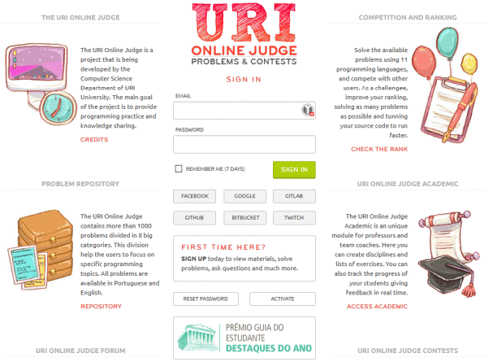

# URI Online Judge

A repository of solutions for the URI Online Judge problems using C# language.

**Screenshot**

[]

## Description

This repository is built as problems are solved at the site. URI Online Judge Problems and Contests has more than 2000 problems and 9 main categories. It's supports many languages (including C, C++, C#, Go, Haskell, Java, JavaScript, Kotlin, Lua, Pascal, Python, Ruby and Scala) and is very useful to practice and learn programming.

## Installation

There's no need to install. All the projects of the VS Solution are small Console Applications or SQL Scripts intented to solve some basic programming problem.

## Usage

Project problems are separated into categories. Each directory corresponds to the same main cateogory of the site. Just browse through this folder and search the project by number.

## Build With

- Microsoft Visual Studio 2019 Community Edition
- uDebug (https://www.udebug.com/)

## Contributing

Check out the [contribution guidelines](https://github.com/filimor/uri-online-judge/blob/master/CONTRIBUTING.md) and follow our [code of conduct](https://github.com/filimor/uri-online-judge/blob/master/CODE_OF_CONDUCT.md) if you want to contribute to this project.

## Translations

TODO

## Credits

- All problems by [URI Online Judge](https://www.urionlinejudge.com.br) Problems & Contest
- All solutions coded by @filimor

## Contact

- E-mail: filimor@posteo.net
- LinkedIn: https://www.linkedin.com/in/filimor/
- Twitter: https://www.twitter.com/filimorbr/

## License

This project is licensed under the MIT License - see the [LICENSE.md](https://github.com/filimor/rollin-ball/blob/master/README.md "MIT") file for details.

